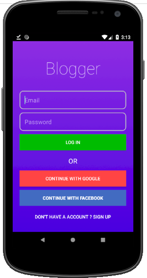
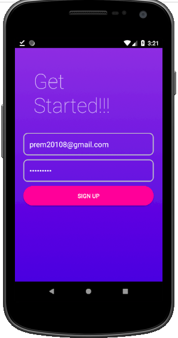
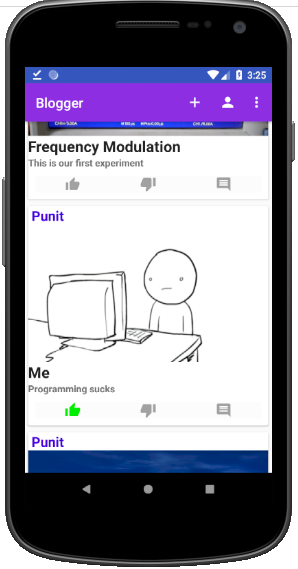
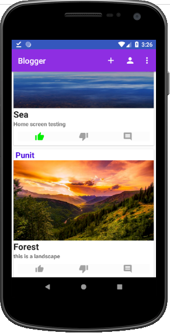
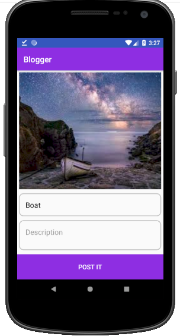
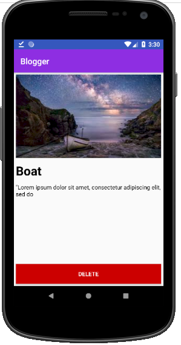

# Blogger
This a Blog App. Users can create a account and post any images with some description or see other users' uploads and get information from the content

# Features
* Authentication with Facebook and Google
* Image Uploading and caching with Picasso
* Likes,comment
* Content Read/Write
* API used - Firebase

# ScreenShots

  
   
    
     
      
       

